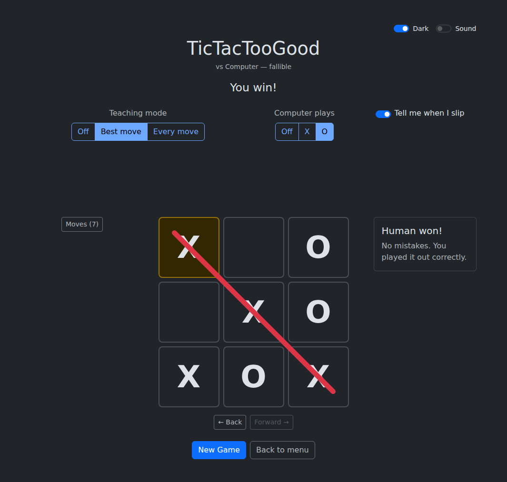

# TicTacTooGood

To help an aspiring tic-tac-toe champion in their quest for total domination.

A tic-tac-toe app that teaches. It does it two ways.

**Tutorials** walk you through four strategies that win against real people —
three traps and one defence — then hand you the same line to run yourself
against an opponent scripted to fall for it.

**Games** are watched by a solver that evaluates every legal move, so the board
can show you which squares hold the win, name the pattern behind them, warn you
the moment you throw the game, and walk you back through your mistakes when it
is over.


Then practise it against the computer. Choose a perfect opponent or a fallible
one, hand it either mark, or switch it off mid-game. The solver keeps watching:
it stars the strongest square and names the pattern, offers the move back the
moment you throw the win, and at the end says whether you played it cleanly.



## Quick start

With [Docker](https://docs.docker.com/get-docker/):

```bash
docker compose up
```

Then open <http://localhost:5173>.

### Without Docker

Needs [Node 22+](https://nodejs.org) and [uv](https://docs.astral.sh/uv/).
Run each in its own terminal:

```bash
cd backend  && uv run flask --app app run --port 5000   # API
cd frontend && npm install && npm run dev               # UI on :5173
```

Vite proxies `/api` to the backend, so use `http://localhost:5173` either way.

## The tutorials

Each trap reaches a position where the opponent has **no block to play** — the
one rule every novice knows gives them nothing to do — and yet most of their
replies still lose to a fork one move later.

| Tutorial     | You open | They answer     | Your trap move         | Their replies that lose |
| ------------ | -------- | --------------- | ---------------------- | ----------------------- |
| Centre first | centre   | corner          | the opposite corner    | 4 of 6                  |
| Corner first | corner   | centre          | the opposite corner    | 2 of 6                  |
| Side first   | a side   | adjacent corner | the perpendicular side | 3 of 6                  |
| Going second | —        | —               | —                      | how not to lose         |

The lines are not prose. Which squares lose, and which move punishes each
reply, live in `frontend/src/tutorials.json` and are proved against the solver
by `backend/tests/test_tutorials.py` — so the app cannot teach a line the
engine disagrees with.

## How it works

The backend solves the position by minimax over all 5,478 reachable boards and
returns a verdict for every legal move. The frontend plays the game and renders
that verdict.

```
backend/    Flask API + solver      frontend/       React + Vite
  solver.py   minimax                 game.js         rules and judgement
  rules.py    names each move         useGameHistory  time travel
  opponent.py perfect and fallible    Game.jsx        the game screen
  app.py      POST /api/analyse       Tutorial.jsx    watch, then try
                                      tutorials.json  the proved facts
```

The tutorials need no backend at all: their opponent is a scripted list of
replies, so nothing is fetched while one is running.

## Tests

```bash
cd backend  && uv run pytest && uv run ruff check .
cd frontend && npm test && npm run lint
```
